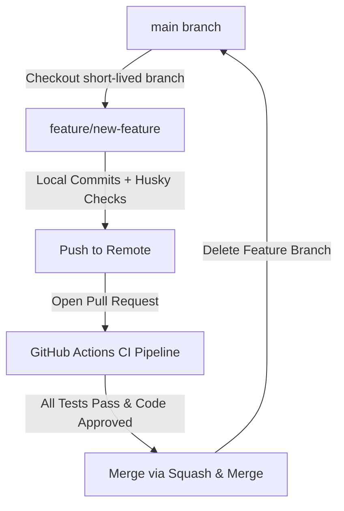

# 🌿 Branching Strategy

This project follows a lightweight, **Trunk-Based Development** workflow designed to minimize merge conflicts and ensure continuous integration.

---

## 🏗️ Repository Architecture

```text
main (Always stable, production-ready, protected)
 └── feature/base-page
 └── feature/logger
 └── feature/config
 └── feature/reporting
 └── feature/api
 └── feature/mcp
 └── feature/ai-planner
 └── feature/ai-generator
 └── feature/ai-healer
```

---

## 👥 Branch Definitions

### 🟠 The Main Branch (`main`)
* **Always Stable:** Code in `main` must pass all local automation suites before merging.
* **Protected:** Direct pushes to `main` are blocked. All code must arrive via Pull Requests.
* **Production-Ready:** Represents the absolute source of truth for the testing framework.

### 🔵 Feature Branches (`feature/*`)
* **Short-Lived:** Created for a single, isolated task and deleted immediately after merging.
* **Naming Convention:** Use lowercase with hyphens descriptive of the scope (e.g., `feature/login-page`).

---

## 🔄 Delivery Workflow



### 📋 Step-by-Step Execution

1. **Branch out:** Pull the latest changes from `main` and branch out locally.
   ```bash
   git checkout main && git pull
   git checkout -b feature/your-feature-name
   ```
2. **Develop & Verify:** Write your Playwright code. Local Husky hooks will check your formatting and linting on commit.
3. **Open Pull Request (PR):** Push your branch to GitHub and open a PR against `main`.
4. **CI Pipeline Validation:** GitHub Actions automatically triggers and runs the test suite against the OrangeHRM demo site.
5. **Squash & Merge:** Once the build passes, squash the commits into a single clean conventional commit and merge.

